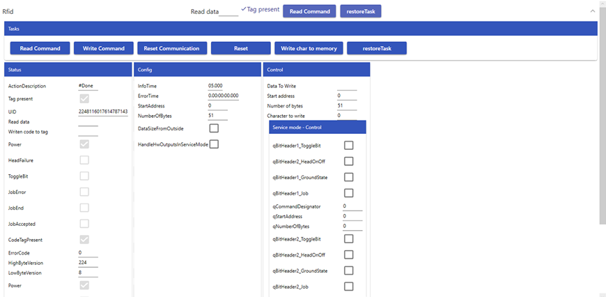
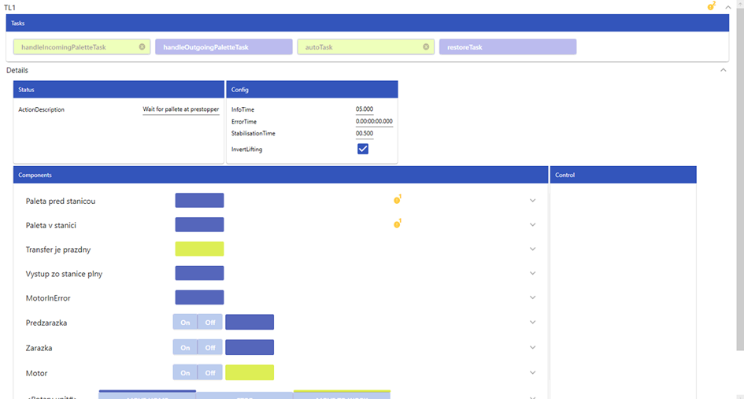

# TcoCore

[INTRODUCTION](docs/Introduction.md)

## Components

### Generic Component rendering
 

The default display of a generic component is in an expander.
In the expander header, the most important status information is shown (see figure above), which provides a quick overview of the current device state – for example, basic status, error messages, or connection information.

When the expander is expanded, more complex information is displayed, divided into several sections:
-	Top section: always contains a list of tasks available for the component. These tasks represent specific functions or operations – e.g., movement, reset, diagnostics, test modes, etc.
-	Left section: displays the component’s status – such as current operating state, errors, warnings, or basic values (position, power status, etc.).
-	Config section: contains configuration data of the component – parameters such as identifiers, device types, communication settings, and other technical data.
-	Control section (if available): enables manual control of selected component functions (e.g., start, reset, output activation, etc.).

This structure allows quick orientation while also providing detailed access to information and control without the need to switch between multiple screens.

```pascal
{attribute 'qualified_only'}
TYPE GenericComponent EXTENDS TcoCore.TcoComponent
VAR
    {attribute addProperty Name "<#Config#>"}
    _config  : SomeTcoGenericComponent_Config;

    {attribute addProperty Name "<#Status#>"}
    _status  : SomeTcoGenericComponent_Status;

    {attribute addProperty Name "<#Control#>"}
    _control : SomeTcoGenericComponent_Control;
END_VAR
END_TYPE
```

### Generic rendering of a Wrapped Component
A wrapped component has the same basic structure as a generic component – consisting of a header in an expander, a basic overview of states, and an expanded part with sections like Status, Config, Control (if available), and the task list in the top part.
	
The difference is that a wrapped component groups and displays already existing generic components that are part of it internally. These are visually embedded (wrapped) into a single unit and serve as subcomponents.
 
 
Properties of a wrapped component:

- Displays internal generic components, which themselves already represent functional modules (e.g., xis, camera, sensor...).
- Each of these nested components retains its own functionality and status information.
- A wrapped component thus serves as a higher-level element that enables unified display and control of multiple related components at once – for example, in the case of complex technology consisting of several devices from different manufacturers.

```pascal
TYPE WrappedComponent EXTENDS TcoCore.TcoComponent
VAR
    {attribute addProperty Name "<#Config#>"}
    _config     : SomeTcoGenericComponent_Config;

    {attribute addProperty Name "<#Status#>"}
    _status     : SomeTcoGenericComponent_Status;

    {attribute addProperty Name "<#Control#>"}
    _control    : SomeTcoGenericComponent_Control;

    {attribute addProperty Name "<#Components#>"}
    _components : SomeTcoGenericComponent_Components := (Parent := THIS^);
END_VAR
END_TYPE
```

## Dialogs 

Registration dialogs is defined by *.SetPlcDialogs(DialogProxyServiceWpf.Create(new[] { PlcTcoCoreExamples.EXAMPLES_PRG._diaglogsContext}));*

### Important: For correct behavior use this order of definition in your app. 

```csharp
   PlcTcoCoreExamples.Connector.BuildAndStart();

    TcOpen.Inxton.TcoAppDomain.Current.Builder
    .SetUpLogger(new TcOpen.Inxton.Logging.SerilogAdapter(new LoggerConfiguration()
                                            .WriteTo.Console(restrictedToMinimumLevel: Serilog.Events.LogEventLevel.Verbose)
                                            .WriteTo.Notepad()
                                            .MinimumLevel.Verbose()))
    .SetDispatcher(TcoCore.Wpf.Threading.Dispatcher.Get)
    .SetPlcDialogs(DialogProxyServiceWpf.Create(new[] { PlcTcoCoreExamples.EXAMPLES_PRG._diaglogsContext}));
```

### Plc Hide dialog

```csharp		
	0:
		_dialog1.Restore();
		_dialog2.Restore();
		_dialog3.Restore();
		_dialog4.Restore();
		_dialogCustomized.Restore();
```

### Plc Example usage of Dialog

```csharp
   15:
        _dialog1.Show()
            .WithType(eDialogType.Question)
            .WithYesNoCancel()
            .WithCaption('Hey 2')
            .WithText('Do we go ahead?');

        IF (_dialog1.Answer = TcoCore.eDialogAnswer.Yes) THEN
            _state := 20;
        END_IF;

        IF (_dialog1.Answer = TcoCore.eDialogAnswer.No) THEN
            _state := 1000;
        END_IF;

        IF (_dialog1.Answer = TcoCore.eDialogAnswer.Cancel) THEN
            _state := 0;
            _invokeDiaglog1 := FALSE;
        END_IF;
```


### Plc Example usage of Dialog with Image

```csharp
 10:
        _dialog1.Show()
            .WithType(eDialogType.Question)
            .WithYesNoCancel()
			.WithImage('D:\MTS\Develop\TcOpenGroup\TcOpen\assets\logo\TcOpenLogo.png',500,500)
            .WithCaption('Hey 1')
            .WithText('Do we go ahead to 2?');

        IF (_dialog1.Answer = TcoCore.eDialogAnswer.Yes) THEN
            _state := 15;
        END_IF;

        IF (_dialog1.Answer = TcoCore.eDialogAnswer.No) THEN
            _state := 1000;
        END_IF;

        IF (_dialog1.Answer = TcoCore.eDialogAnswer.Cancel) THEN
            _state := 0;
            _invokeDiaglog1 := FALSE;
        END_IF;
```


### Plc Example usage of Dialog Ok only

```csharp
  20:
        IF (_dialog2.Show()
            .WithType(eDialogType.Info)
            .WithOk()
            .WithCaption('Hey')
            .WithText('We go ahead.')
            .Answer =
            TcoCore.eDialogAnswer.OK) THEN
            _state := 30;
        END_IF
```


### Plc Example usage of Dialog Timed out (External close)

Here may be used any signal or condition when dialog should be closed with choosen answer.

```csharp
  30:
        _state := 40;
        _tonDisposeDialog(In := FALSE);
    40:
        _tonDisposeDialog(IN := TRUE, PT := T#4S);
		_dialog4.ShowWithExternalClose(inOkAnswerSignal:=FALSE , inYesAnswerSignal:= _tonDisposeDialog.Q, inNoAnswerSignal:= FALSE, inCancelAnswerSignal:= FALSE)
		    .WithType(eDialogType.Info)
            .WithYesNoCancel()
            .WithCaption('Hey')
            .WithText('Do you wana retry it? Yes answer will be set in 4 sec?');

        IF (_dialog4.Answer = TcoCore.eDialogAnswer.Yes) THEN
            _state := 0;
        END_IF;

        IF (_dialog4.Answer = TcoCore.eDialogAnswer.No) THEN
            _state := 50;
        END_IF;

        IF (_dialog4.Answer = TcoCore.eDialogAnswer.Cancel) THEN
            _state := 0;
            _invokeDiaglog1 := FALSE;
        END_IF;
```


### Plc Example usage of Customized Dialog

Here may be used any signal or condition when dialog should be closed with choosen answer.

```csharp
  50:
         _dialogCustomized.Show()
            .WithType(eDialogType.Info)
            .WithOption1('This is Option1=>retry')
			  .WithOption2('This is Option2=>first step')
			    .WithOption3('This is Option3 =>continue')
				  .WithOption4('This is Option4=>stop sequence')
            .WithCaption('Hey')
            .WithText('What we are going to do.');
            
			 IF (_dialogCustomized.Answer = TcoCore.eCustomizedDialogAnswer.Option1) THEN
				_state := 50;
			END_IF;
	
			IF (_dialogCustomized.Answer = TcoCore.eCustomizedDialogAnswer.Option2) THEN
				_state := 0;
			END_IF;
	
			IF (_dialogCustomized.Answer = TcoCore.eCustomizedDialogAnswer.Option3) THEN
				_state := 51;
			END_IF;
	
			IF (_dialogCustomized.Answer = TcoCore.eCustomizedDialogAnswer.Option4) THEN
				_state := 0;
				_invokeCustomizedDiaglog := FALSE;
				_invokeDiaglog1 := FALSE;
			END_IF;
```


## Plc Example usage of Customized Dialog with image

```csharp
 51:
         _dialogCustomized.Show()
            
            .WithOption1('This is Option1=>retry')
			  .WithOption2('This is Option2=>first step')
			    .WithOption3('This is Option3 =>continue')
			.WithImage('D:\MTS\Develop\TcOpenGroup\TcOpen\assets\logo\TcOpenWide.png',500,500)
            .WithCaption('Hey')
            .WithText('What we are going to do.');
            
			 IF (_dialogCustomized.Answer = TcoCore.eCustomizedDialogAnswer.Option1) THEN
				_state := 50;
			END_IF;
	
			IF (_dialogCustomized.Answer = TcoCore.eCustomizedDialogAnswer.Option2) THEN
				_state := 0;
			END_IF;
	
			IF (_dialogCustomized.Answer = TcoCore.eCustomizedDialogAnswer.Option3) THEN
				_state := 60;
			END_IF;
	
			IF (_dialogCustomized.Answer = TcoCore.eCustomizedDialogAnswer.Option4) THEN
				_state := 0;
				_invokeCustomizedDiaglog := FALSE;
				_invokeDiaglog1 := FALSE;
			END_IF;
```


## Plc Example usage of Input Dialog 

### Declaration

```csharp
     _customizedContentInput	: MyOwnContent(THIS^);
	_dialogWithInput        : TcoCore.TcoInputDialog(THIS^);
```

### Structure defined by user that will be displayed in dialog as input fields 

```csharp
FUNCTION_BLOCK MyOwnContent EXTENDS TcoCore.TcoInputDialogContentContainer
VAR_INPUT
END_VAR
VAR_OUTPUT
END_VAR
VAR
	{attribute addProperty Name "<#Recipe#>"}
	Recipe:STRING;
	{attribute addProperty Name "<#Qantity#>"}
	RequiredQuantity:INT;
	{attribute addProperty Name "<#Timeout#>"}
	Timeout:DATE_AND_TIME;
	{attribute addProperty Name "<#Exclude#>"}
	Exclude:BOOL;

END_VAR
```

### Usage

```csharp
    100:
                _dialogWithInput.Show(refContent:=_customizedContentInput)
                .WithType(eDialogType.Question)
                .WithYesNo()
                .WithCaption('Hey wana set data')
                .WithText('Do you realy want to sent data to ....?');

            IF (_dialogWithInput.Answer = TcoCore.eInputDialogAnswer.Yes) THEN
                _state := 15;
            END_IF;

            IF (_dialogWithInput.Answer = TcoCore.eInputDialogAnswer.No) THEN
                _state := 1000;
            END_IF;

```

## Plc Example usage of Input Dialog with image

### Usage

```csharp
110:
			_dialogWithInput.Show(refContent:=_customizedContentInput)
            .WithType(eDialogType.Question)
            .WithOk()
			.WithImage('https://github.com/TcOpenGroup',400,600)
            .WithCaption('Hey wana set data')
            .WithText('Do you realy want to sent data to ....?');

	
	
			IF (_dialogWithInput.Answer = TcoCore.eInputDialogAnswer.OK) THEN
				_state := 1000;
	            _invokeInputDiaglog := FALSE;

			END_IF;
```

