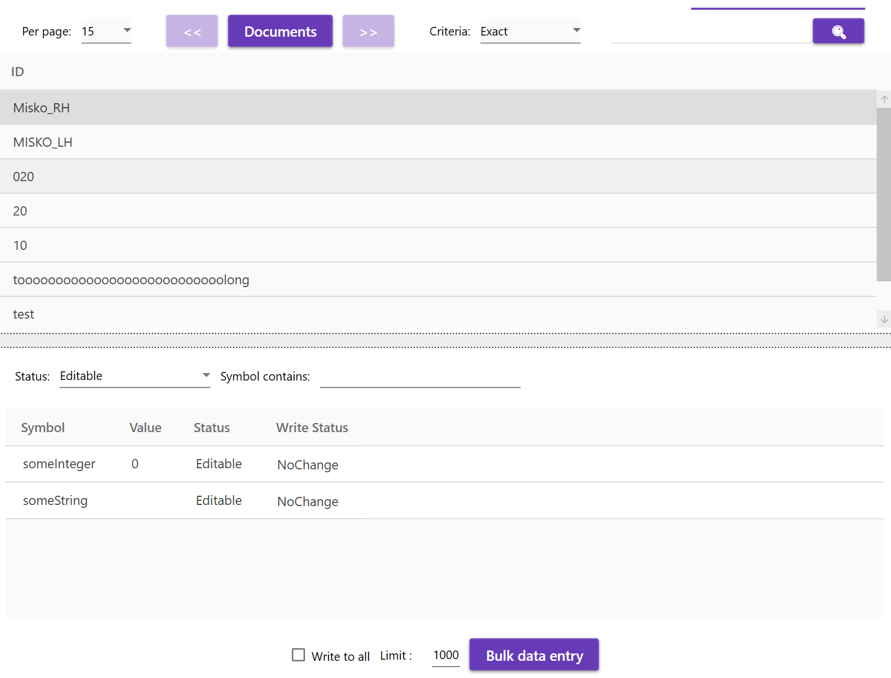
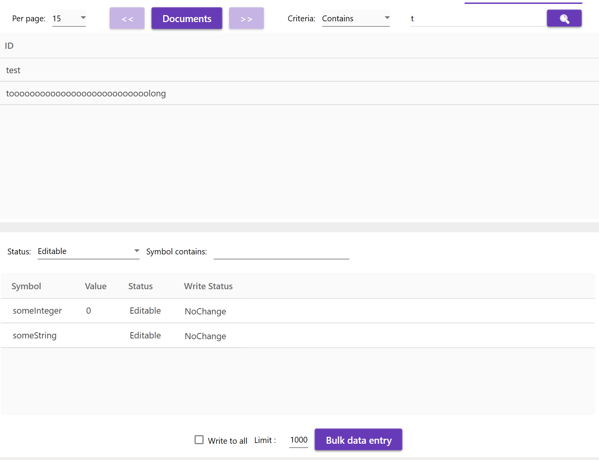
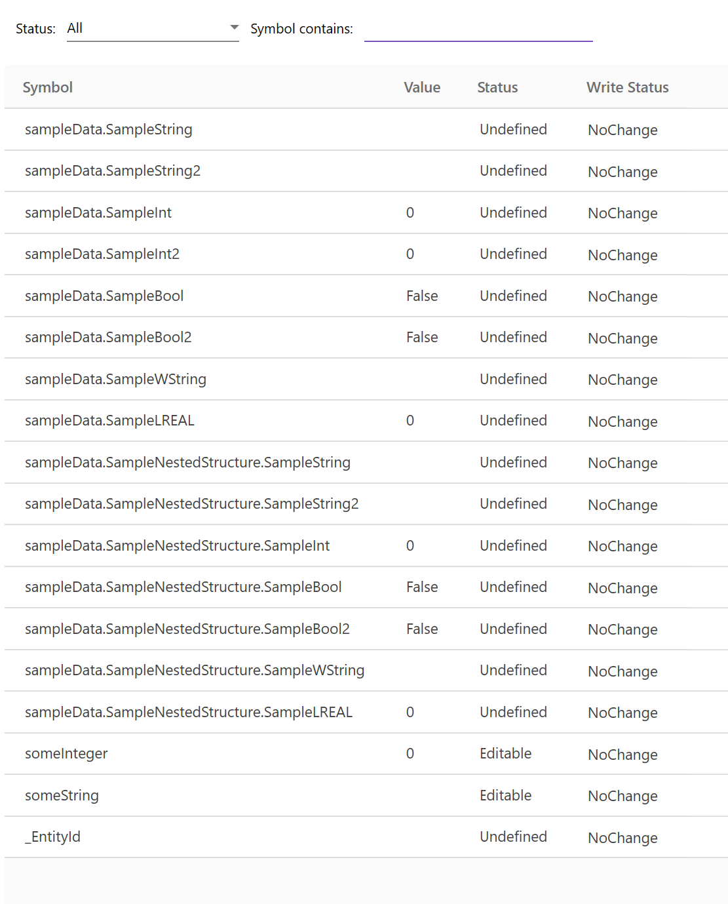
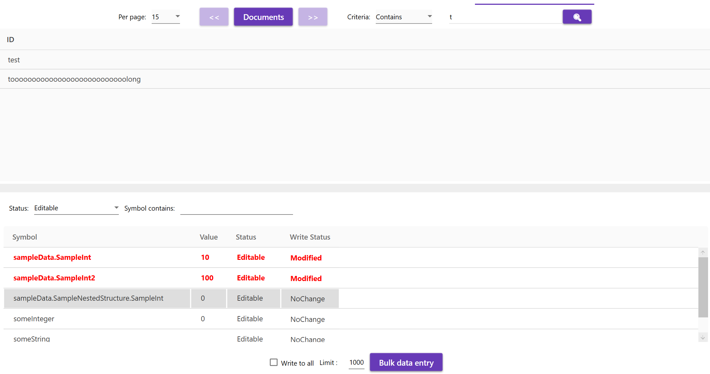
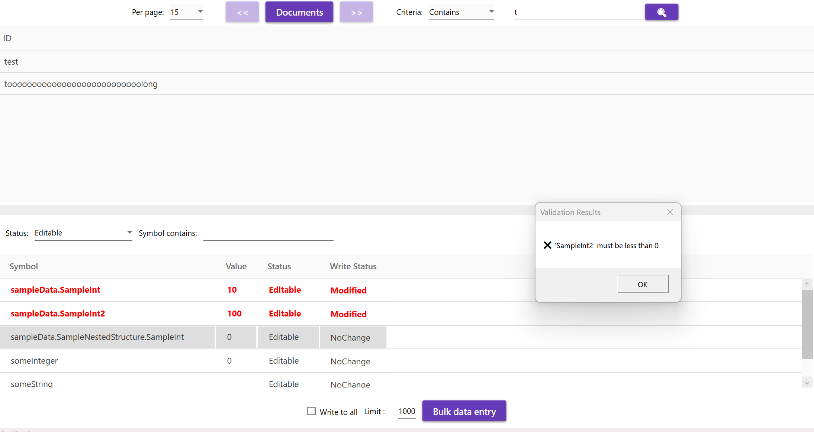

# TcoData
## Introduction

The TcoData library is a comprehensive software framework designed to facilitate efficient data handling by remote task execution in industrial automation and control systems. This library serves as a bridge between programmable logic controllers (PLCs) and PC-based data repositories, enabling seamless communication, data manipulation, and task execution across distributed systems.


## Example of definition repository

```csharp
  var parameters = new MongoDbRepositorySettings<PlainSandboxData>("mongodb://localhost:27017", "TestDataBase", "TestCollection");
            var repository = Repository.Factory<PlainSandboxData>(parameters);

	// initialize repository
	Entry.TcoDataTests.MAIN.sandbox.DataManager.InitializeRepository(repository);
    // if data exchange PLC<->PC based system is reqired
	Entry.TcoDataTests.MAIN.sandbox.DataManager.InitializeRemoteDataExchange();
```
	

## Example of fragmented repositories

### PLC1
```csharp
TYPE stProcessData_Plc1 EXTENDS TcoData.TcoEntity :
STRUCT
	{attribute wpf [Container(Layout.Stack)]}
	{attribute addProperty Name "Entity header"}
	EntityHeader, stEntityHeader: BOOL;	
	_Modified : DT;
	_Created : DT;
	{attribute wpf [Container(Layout.Stack)]}
	{attribute addProperty Name "Cu1"}	
	Cu_1 : stCu_ProcessData;
END_STRUCT
END_TYPE
```

```csharp
//<DataManagerDeclarations>
// Function block for data maipulation must extend from TcoData.TcoDataExchange.
FUNCTION_BLOCK TcoDataManagerPlc1 EXTENDS TcoData.TcoDataExchange
VAR
	// This is the structure that contains the actual data we will work with. The `STRUCT` must extend `TcoData.TcoEntity`
    _data : stProcessData_Plc1;
END_VAR
//</DataManagerDeclarations>
```

```csharp
	var parametersFragmentedPlc1 = new MongoDbRepositorySettings<PlainstProcessData_Plc1>("mongodb://localhost:27017", "TestDataBase", "TestProcessData");

	List<Expression<Func<PlainstProcessData_Plc1, PlainstProcessData_Plc1>>> fragmentExpressionPlc1 = new List<Expression<Func<PlainstProcessData_Plc1, PlainstProcessData_Plc1>>>();
	// here you can add  members  you interested in (option 1)
	fragmentExpressionPlc1.Add(data => new PlainstProcessData_Plc1 { EntityHeader = data.EntityHeader });
	fragmentExpressionPlc1.Add(data => new PlainstProcessData_Plc1 { Cu_1 = data.Cu_1  });

	var repositoryFragmentedPlc1 = new MongoDbFragmentedRepository<PlainstProcessData_Plc1, PlainstProcessData_Plc1>(parametersFragmentedPlc1, fragmentExpressionPlc1);
	Entry.TcoDataTests.MAIN.sandbox.DataManagerPlc1.InitializeRepository(repositoryFragmentedPlc1);
```
---
**_Note:_**

`DataManagerPlc1` will handle  only with data defined in fragmentExpresion. That means only data defined in fragments for this repository will be updated.Data such as `_Modified` and `_Created` are skiped for writing (are not in list).

 #### Data  created via UI view  PLC 1 repository


 #### Data storesd in  repository PLC1


### PLC2

```csharp
TYPE stProcessData_Plc2 EXTENDS TcoData.TcoEntity :
STRUCT
	{attribute wpf [Container(Layout.Stack)]}
	{attribute addProperty Name "Entity header"}
	EntityHeader, stEntityHeader: BOOL;	
	_Modified : DT;
	_Created : DT;
	{attribute wpf [Container(Layout.Stack)]}
	{attribute addProperty Name "Cu2"}	
	Cu_2 : stCu_ProcessData;

END_STRUCT
END_TYPE
```
```csharp
//<DataManagerDeclarations>
// Function block for data maipulation must extend from TcoData.TcoDataExchange.
FUNCTION_BLOCK TcoDataManagerPlc2 EXTENDS TcoData.TcoDataExchange
VAR
	// This is the structure that contains the actual data we will work with. The `STRUCT` must extend `TcoData.TcoEntity`
    _data : stProcessData_Plc2;
END_VAR
//</DataManagerDeclarations>
```


```csharp
    var parametersFragmentedPlc2 = new MongoDbRepositorySettings<PlainstProcessData_Plc2>("mongodb://localhost:27017", "TestDataBase", "TestProcessData");

	List<Expression<Func<PlainstProcessData_Plc2, PlainstProcessData_Plc2>>> fragmentExpressionPlc2 = new List<Expression<Func<PlainstProcessData_Plc2, PlainstProcessData_Plc2>>>();
	// here you can add  members  you interested in (option 2)

	fragmentExpressionPlc2.Add(data => new PlainstProcessData_Plc2 { EntityHeader = data.EntityHeader, Cu_2 = data.Cu_2 });
	;
	var repositoryFragmentedPlc2 = new MongoDbFragmentedRepository<PlainstProcessData_Plc2, PlainstProcessData_Plc2>(parametersFragmentedPlc2, fragmentExpressionPlc2);
	Entry.TcoDataTests.MAIN.sandbox.DataManagerPlc2.InitializeRepository(repositoryFragmentedPlc2);
```

---
**_Note:_**

`DataManagerPlc2` will handle  only with data defined in fragmentExpresion. That means only data defined in fragments for this repository will be updated.Data such as `_Modified` and `_Created`  are skiped during writing.


 #### Data  created via UI view  PLC 2 repository


 #### Data stored in  repository PLC2


## Bulk data edit

**Bulk Data Edit** is a tool that enables writing predefined data values to **all records in a repository (e.g., recipes)** or **filtered data**. It is especially useful for batch modifications and initializing multiple  entity instances at once stored in repository(Mongo Db).

The tool supports:

- Selecting which members are editable (defined by the developer)
- Applying input validation before writing
- Controlling which fields are modified based on their status flags


### Initializing the Bulk Model

You begin by initializing the `BulkTraversalModel`, providing it with a repository and (optionally) a validation delegate:

```csharp
BulkModel = new BulkTraversalModel<PlainSandboxData, BulkDataItem>(repository);
```
### Initializing the Bulk Model with validator

This ensures that no record with invalid data will be written to the repository.

```csharp
ValidateDataDelegate<PlainSandboxData> validator = data =>
            {
                return new DataItemValidation[]
                {
        new DataItemValidation($"'{nameof(data.sampleData.SampleInt)}' must be greater than 0", data.sampleData.SampleInt <= 0),
        new DataItemValidation($"'{nameof(data.sampleData.SampleInt2)}' must be less than 0", data.sampleData.SampleInt2 > 0)
                };
            };

            BulkModel = new BulkTraversalModel<PlainSandboxData, BulkDataItem>(repository,
             validator
                    );
```

### Defining Editable Members

To control which members are considered editable, you define them programmatically (e.g., using property names from your entity). The following snippet demonstrates how to determine if a symbol path matches the editable list:

```csharp
BulkModel.UpdateFromDataTemplate((symbol, value) =>
{
    var editable = BulkItemStatus.Undefined;

    var editableMembers = PropertyHelper.GetPropertiesNames(
        new PlainSandboxData(), 
        p => p.someInteger, 
        p => p.someString,
		p=>p.sampleData.SampleInt
    );

    if (editableMembers.Any(member => symbol.Contains(member)))
    {
        editable = BulkItemStatus.Editable;
    }

    return new BulkDataItem
    {
        Symbol = symbol,
        Value = value,
        Status = editable,
        WriteStatus = BulkItemWriteStatus.NoChange,
        OriginalValue = value
    };
});
```

#### Explanation

- editableMembers: List of property names allowed for editing

- symbol: Full symbol path generated during entity traversal 

- Only symbols matching the allowed members are marked as Editable

- The rest are left Undefined and will not be modified

## Status Flags
Two status flags control whether an item is editable and whether it should be written:

BulkItemStatus.Editable: Indicates that the item is allowed to be changed

BulkItemWriteStatus.NoChange: Default value meaning “not modified yet”

Only items with Status == Editable and WriteStatus == Modified will be written back to the repository during the update process.

***No filtered entities***


***Filtered entity - only two entities shown below will be modified***


***All member are shown below***


***Only modified members will be changed and  trasfered to entities (test,toooooooooooooooLong)***


***Only modified members will be changed and  trasfered to entities (test,toooooooooooooooLong), but validation must be done correctly otherwise data not modified and validation result is reported  ***
